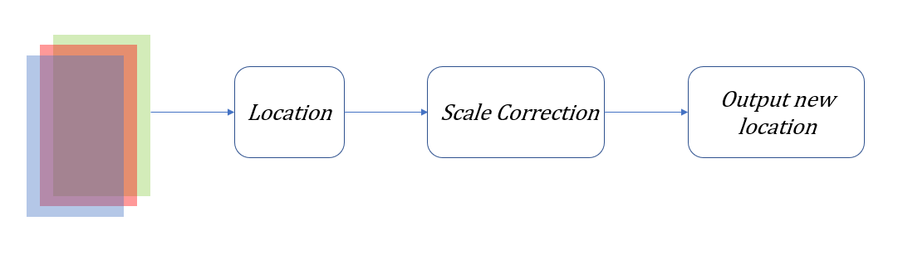
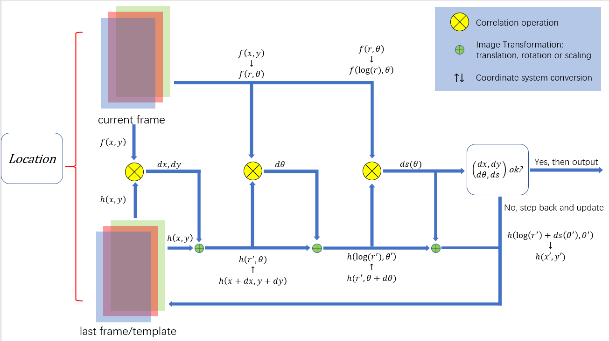

# pyCFTrackers with an Onmidirectional Scale Estimator

This project is adapted from the [pyTracker project released by fengyang95](https://github.com/fengyang95/pyCFTrackers).

The improvement of pyCFTracker is as follows:
1. An (OSE) Omnidirectional Scale Estimator is added to replace the original scale estimator in DCF-CSR tracker;
2. Iterative estimation of translation, rotation and a scaling correction method are applied in the estimation process.

The new algorithm is called **GOITLM** (Geometric Optics based Iterative Target Location Method in Object Tracking) and is right now under patent review.

You can find the working mechanism of GOITLM in the technique report in [GoogleDrive](https://drive.google.com/drive/folders/1i-294Y137ySk-4afjPpypxodpGenpJPZ?usp=share_link)

The Omnidirectional Scale Estimator source codes locate at [MRScale_estimator.py](https://github.com/ShawnZou717/pyCFTrackers/blob/master/cftracker/MRScale_estimator.py).

## Usage
The usage of this new tracker is identical to DCF-CSR tracker. Copy the scripts to play around with the new tracker. To read the principle of this tracker please refer to the following section.
```python
# import OSE inserted CSRDCF tracker
import cv2
from cftracker.csrdcf_mr import CSRDCF_MR
from cftracker.config import csrdcf_config

# create_tracker with given configuration
def create_tracker():
    tracker=CSRDCF_MR(csrdcf_config.CSRDCFConfig())
    return tracker

tracker = create_tracker()

# read video with opencv api
video = cv2.VideoCapture('Your Video File Path')

if not video.isOpened():
    print("Could not open video")
    sys.exit()

i = 0
while True:
    ok, frame = video.read()
    if ok is None or frame is None:
        break
    else:
        i += 1

    if i == 1:
        # given the ground truth of object of the first frame
        box = cv2.selectROI("Frame", frame, romCenter=False,showCrosshair=True)

        # initiate tracker with ground truth of objects in the first frame
        tracker.init(frame, box)

    # bbox: upleft x, upleft y, width, height
    bbox = tracker.update(frame)
    p1 = (int(bbox[0]), int(bbox[1]))
    p2 = (int(bbox[0] + bbox[2]), int(bbox[1] + bbox[3]))

    cv2.rectangle(frame, p1, p2, (255, 0, 0), 2, 1)
    cv2.putText(frame, "Tracked", p1, cv2.FONT_HERSHEY_SIMPLEX, 0.75, (255, 0, 0), 2)

    cv2.imshow("", frame)
    key = cv2.waitKey(1) & 0xFF

video.release()
cv2.destroyAllWindows()

```

## GOITLM

The geomatric optics theory has shown that radious along different directions varies at different rate in the imaging plane if the object is moving (See technique report in [GoogleDrive](https://github.com/ShawnZou717/pyCFTrackers/blob/master/cftracker/MRScale_estimator.py)). 

The main feature of GOITLM relies in its iterative estimation method and OSE. OSE performs a iterative estimation of translation, rotation and scaling factor, and applies a cubic polynomial equation to correct the estimating error of scaling factors. Working flow of GOITLM is shown below.

<center></center>
<center></center>
<center><p><b>Fig.1 Basic working flow of GOITLM tracker</b></p></center>


Tracker is divided into 5 steps:

1. Extracting features of the current frame;
2. Computing similarity function respectively in the Cartesian, polar, log polar coordinate, and searching peak position as the estimation result of translation, rotation and scaling;
3. If the estimated results satisfy the stop condition, break iteration, output translation, rotation and scale estimation, and continue to the next step; If not, jump back to step 2;
4. Fitting the cubic polynomial equation with the scale estimation results from the former N frames. Computing the predicted scale at the current frame with the fitted equation, and correct the estimated scales given by step 3;
5. Computing the new location according to translation, rotation and corrected scale.

